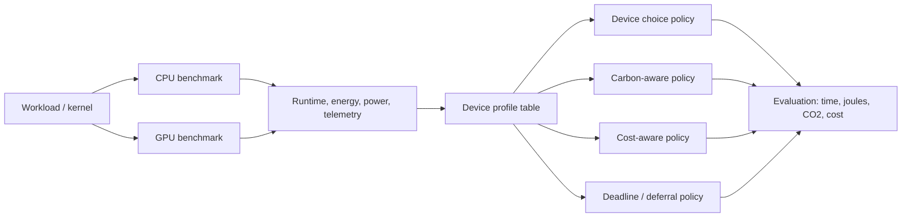
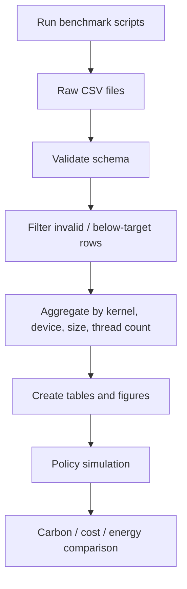

# Energy-Aware CPU/GPU Benchmarking and Scheduling Artifact

> Empirical benchmark suite for comparing CPU and GPU execution across runtime, energy, power, and hardware telemetry.  
> The repository is intended as a research artifact for carbon-, cost-, and energy-aware execution decisions on heterogeneous systems.

[](LICENSE)


---

## Table of contents

- [Overview](#overview)
- [Why this repository exists](#why-this-repository-exists)
- [Research idea](#research-idea)
- [What is measured](#what-is-measured)
- [Benchmark kernels](#benchmark-kernels)
- [Hardware targets](#hardware-targets)
- [Repository structure](#repository-structure)
- [Measurement design](#measurement-design)
- [CSV schema](#csv-schema)
- [Quick start](#quick-start)
- [Running CPU benchmarks](#running-cpu-benchmarks)
- [Running GPU benchmarks](#running-gpu-benchmarks)
- [Using the existing result figures](#using-the-existing-result-figures)
- [Analysis workflow](#analysis-workflow)
- [Interpreting the results](#interpreting-the-results)
- [Reproducibility notes](#reproducibility-notes)
- [Known limitations](#known-limitations)
- [Suggested next cleanup steps](#suggested-next-cleanup-steps)
- [Citation / attribution](#citation--attribution)
- [License](#license)

---

## Overview

This repository contains a heterogeneous CPU/GPU benchmarking framework for studying when it is preferable to execute numerical workloads on a CPU or a GPU.

The central question is not only:

> Which device is fastest?

but also:

> Which device is more energy-efficient, cheaper, or cleaner under a given carbon-intensity and electricity-price signal?

The current repository focuses on the profiling layer of that question. It contains benchmark programs and measurement scripts for several representative compute and memory kernels. Each benchmark records timing, energy, power, device telemetry, and derived efficiency metrics into CSV files.

The project can be used as a basis for:

- CPU-vs-GPU energy comparison
- heterogeneous scheduling experiments
- carbon-aware execution studies
- cost-aware execution studies
- empirical Green IT / sustainable computing research
- portfolio demonstration of systems measurement, CUDA, C++, Linux telemetry, and reproducible data analysis

---

## Why this repository exists

A GPU is often assumed to be the better execution device for compute-heavy workloads. That is not always the full story.

A GPU may deliver much higher throughput, but it can also have:

- higher instantaneous power draw,
- transfer overheads,
- device warm-up effects,
- PCIe bottlenecks,
- idle-state and clock-state effects,
- different energy behavior depending on workload size,
- different behavior for compute-bound and memory-bound workloads.

Similarly, a CPU may be slower for large dense compute kernels, but can be competitive for smaller workloads, memory-bound kernels, or cases where avoiding GPU transfers matters.

This repository therefore measures both devices under comparable benchmark conditions and writes the result into a shared CSV format. The goal is to make device-selection decisions data-driven instead of assumption-driven.

---

## Research idea

The repository supports the following research framing:



The benchmark data can be used to evaluate policies such as:

| Policy | Description |
|---|---|
| Always CPU | Execute every workload on the CPU immediately. |
| Always GPU | Execute every workload on the GPU immediately. |
| Device-optimal now | Select the device with the best measured metric for the current workload. |
| Device-optimal + deferral | Select device and possibly delay execution within a deadline window to reduce carbon or electricity cost. |

The repository therefore separates two layers:

1. **Measurement layer**  
   Measure runtime, energy, and telemetry for CPU/GPU implementations.

2. **Policy layer**  
   Use measured profiles to simulate or evaluate scheduling decisions under external price and carbon-intensity signals.

---

## What is measured

The benchmark programs record raw and derived metrics. The common CSV format includes:

| Metric group | Example columns | Purpose |
|---|---|---|
| Run metadata | `timestamp`, `run_id_global`, `run_id_per_size` | Identify individual measurement rows. |
| Device metadata | `device_name`, `num_threads` | Distinguish CPU/GPU and CPU thread count. |
| Workload size | `problem_size`, `batches` | Describe input size and adaptive batch count. |
| Timing | `gpu_e2e_time_s`, `gpu_kernel_time_s`, `wall_time_s` | Compare kernel-only and end-to-end time. |
| Energy | `total_energy_j`, `energy_per_batch_j`, `energy_per_flop_j` | Measure efficiency, not only speed. |
| Throughput | `flops_total`, `gflops_per_s` | Compare performance across sizes. |
| Power | `avg_power_w`, `energy_per_second_j` | Estimate sustained power draw. |
| Quality control | `below_target` | Mark measurements that did not reach the desired timing window. |
| GPU telemetry | `pcie_gen`, `pcie_width`, `sm_clock_mhz`, `mem_clock_mhz`, `temp_c`, `throttle_reasons` | Explain GPU state and possible throttling. |
| CPU telemetry | `cpu_cycles`, `cpu_instructions`, `cpu_ipc`, `cpu_cache_misses` | Explain CPU behavior and validate measurements. |

The important design decision is that every repeated measurement writes its own CSV row. The raw data is not immediately aggregated away. This makes it possible to later compute medians, confidence intervals, outlier checks, and distribution plots.

---

## Benchmark kernels

The repository contains several kernels with CPU and GPU variants.

### 1. GEMM

General matrix multiplication:

```text
C = alpha * A * B + beta * C
```

GEMM is a dense, compute-heavy workload. It is useful for studying the regime where GPUs usually perform very strongly.

Typical use:

- dense linear algebra,
- scientific computing,
- machine learning building blocks,
- throughput and energy-per-FLOP comparison.

### 2. GEMM stride

A GEMM-related benchmark variant that can be used to study access pattern effects and layout-related performance differences.

Typical use:

- memory-layout sensitivity,
- data-access effects,
- comparison against standard GEMM.

### 3. AXPY

Vector update:

```text
y[i] = alpha * x[i] + y[i]
```

AXPY is simple and memory-oriented. It is useful because the operation has low arithmetic intensity: only two floating-point operations per element. This makes it a useful contrast to GEMM.

Typical use:

- memory bandwidth sensitivity,
- CPU/GPU transfer overhead,
- energy behavior for vector operations.

### 4. STREAM Triad

STREAM Triad:

```text
a[i] = b[i] + scalar * c[i]
```

This is a classic memory bandwidth kernel. It helps separate compute-heavy behavior from memory-heavy behavior.

Typical use:

- memory bandwidth,
- cache and memory subsystem effects,
- CPU thread scaling,
- GPU memory throughput.

### 5. Reduction

Reduction aggregates many input values into a smaller output, often a single sum.

Typical use:

- parallel reduction overhead,
- synchronization effects,
- memory access and arithmetic tradeoffs.

### 6. Convolution

Convolution represents a structured compute pattern that is common in signal processing and machine learning.

Typical use:

- stencil-like computation,
- image processing,
- deep-learning-inspired workload structure.

---

## Hardware targets

The repository is organized around measured hardware targets.

### CPU targets

The CPU benchmark folders distinguish at least:

- AMD
- Intel

CPU measurements use Linux interfaces such as:

- RAPL / powercap energy counters,
- CPU frequency information from `cpufreq`,
- hardware performance counters via `perf_event_open`,
- OpenMP thread control,
- OpenBLAS thread control for GEMM.

### GPU targets

The GPU benchmark folders distinguish at least:

- NVIDIA GeForce RTX 3090
- NVIDIA RTX 5050

GPU measurements use:

- CUDA,
- CUDA events for kernel and end-to-end timing,
- NVML for energy and device telemetry,
- PCIe link information,
- SM and memory clocks,
- temperature,
- throttle-reason flags.

---

## Repository structure

Current high-level structure:

```text
.
├── compute/                 # computation / analysis material, if populated
├── data/                    # data files
├── figs/                    # figures, if populated
├── my_docs/
│   └── intel/               # local notes / documentation
├── scripts/                 # benchmark implementations and run scripts
│   ├── AXPY/
│   │   ├── CPU/
│   │   │   ├── AMD/
│   │   │   └── Intel/
│   │   └── GPU/
│   │       ├── 3090/
│   │       └── 5050/
│   ├── GEMM/
│   │   ├── CPU/
│   │   │   ├── AMD/
│   │   │   └── Intel/
│   │   └── GPU/
│   │       ├── 3090/
│   │       └── 5050/
│   ├── Gemm stride/
│   │   ├── CPU/
│   │   └── GPU/
│   ├── Reduction/
│   │   ├── CPU/
│   │   └── GPU/
│   ├── STREAM_triad/
│   │   ├── CPU/
│   │   └── GPU/
│   └── conv/
│       ├── CPU/
│       └── GPU/
├── tables/                  # result tables
├── LICENSE
└── README.md
```

A typical benchmark folder contains:

```text
00_default_text_optional.sh
01_enable_*.sh
02_run_benchmark*.sh
03_disable_*.sh
04_default_graphic.sh
main.cpp or main.cu
*.csv
logs
compiled benchmark binaries
```

The `01_enable_*` and `03_disable_*` scripts are intended to prepare and restore benchmark-relevant system settings, for example CPU or GPU performance state. The exact behavior should be checked before running them with elevated permissions.

---

## Measurement design

The benchmark programs follow a common design.

### 1. Adaptive batching

Very short measurements are noisy. To reduce this problem, benchmarks automatically choose a batch count so that each measurement reaches approximately a target runtime, typically around one second.

This avoids comparing a very short CPU run against a much longer GPU run, or vice versa.

### 2. Multiple repeated runs

Each configuration is repeated many times, commonly 50 measurements per configuration.

This allows later analysis of:

- median behavior,
- variance,
- outliers,
- temperature drift,
- throttling effects,
- confidence intervals.

### 3. Separate kernel and end-to-end timing

GPU benchmarks distinguish between:

- kernel-only time,
- end-to-end GPU time,
- wall-clock time.

This distinction matters because GPU execution can include host-to-device transfers, device-to-host transfers, synchronization, and launch overhead.

### 4. Energy measurement

CPU energy is measured via RAPL / Linux powercap interfaces where available.

GPU energy is measured via NVML where supported by the NVIDIA device and driver.

### 5. Telemetry capture

The benchmark does not only write time and energy. It also records state information such as clocks, temperature, PCIe link state, and throttling. This is important because energy measurements without telemetry can be difficult to interpret.

### 6. Raw rows instead of only summaries

The repository keeps individual runs instead of only publishing aggregated results. That is the right choice for a research artifact because later analysis can be improved without rerunning all measurements.

---

## CSV schema

The shared CSV schema is designed to support both CPU and GPU rows.

Example columns:

```text
timestamp
run_id_global
run_id_per_size
device_name
num_threads
problem_size
batches
gpu_e2e_time_s
gpu_kernel_time_s
wall_time_s
total_energy_j
energy_per_batch_j
energy_per_second_j
energy_per_flop_j
time_per_gemm_ms_kernel
time_per_gemm_ms_e2e
flops_total
gflops_per_s
avg_power_w
below_target
pcie_gen
pcie_width
sm_clock_mhz
mem_clock_mhz
temp_c
throttle_reasons
cpu_cycles
cpu_instructions
cpu_ipc
cpu_cache_misses
```

For CPU rows, GPU-specific columns are intentionally empty or reused where appropriate. For GPU rows, CPU performance-counter columns may be absent or unused depending on the specific benchmark version.

---

## Quick start

Clone the repository:

```bash
git clone https://github.com/TheBuccaneer/energy.git
cd energy
```

Inspect the available benchmarks:

```bash
find scripts -maxdepth 4 -type f \( -name "main.cpp" -o -name "main.cu" -o -name "02_run_benchmark*.sh" \) | sort
```

Run a small smoke test first. Many benchmark programs support a test mode:

```bash
./cpu_bench --test
./gpu_bench --test
```

The exact binary name depends on the benchmark folder. Use the `02_run_benchmark*.sh` script in each folder as the main entry point.

---

## Running CPU benchmarks

### Requirements

Typical CPU benchmark requirements:

```bash
sudo apt update
sudo apt install build-essential g++ libopenblas-dev pkg-config
```

For OpenMP support, `g++` is usually sufficient when compiling with `-fopenmp`.

For GEMM CPU benchmarks, OpenBLAS is required:

```bash
sudo apt install libopenblas-dev
```

### RAPL access

CPU energy measurements use RAPL via Linux powercap.

Check whether RAPL energy files are readable:

```bash
ls /sys/class/powercap/
find /sys/class/powercap -name energy_uj -print
```

If the energy files exist but are not readable, you may need to adjust permissions:

```bash
sudo chmod -R a+r /sys/class/powercap/*rapl*
```

Depending on your system, you may also need to load a RAPL-related kernel module:

```bash
sudo modprobe intel_rapl_msr
```

On AMD systems, the path names may differ from Intel systems.

### CPU governor

For reproducible benchmarking, use a performance governor where possible:

```bash
cat /sys/devices/system/cpu/cpu0/cpufreq/scaling_governor
```

If necessary:

```bash
sudo cpupower frequency-set -g performance
```

Some benchmark folders already include `01_enable_CPU_*.sh` and `03_disable_CPU_*.sh` scripts for preparing and restoring CPU settings. Read them before executing them.

### Example: CPU GEMM

```bash
cd scripts/GEMM/CPU/AMD
bash 02_run_benchmark_cpu.sh
```

With custom output:

```bash
bash 02_run_benchmark_cpu.sh ../../../data/raw/gemm_cpu_amd.csv
```

### Example: CPU AXPY

```bash
cd scripts/AXPY/CPU/AMD
bash 02_run_benchmark_cpu.sh
```

### Example: CPU STREAM Triad

```bash
cd scripts/STREAM_triad/CPU/AMD
g++ -O3 -march=native -std=c++17 -fopenmp -o stream_cpu main.cpp -lpthread -lm
./stream_cpu --test
```

---

## Running GPU benchmarks

### Requirements

Typical GPU benchmark requirements:

- NVIDIA GPU
- NVIDIA driver
- CUDA toolkit
- NVML library
- `nvcc`
- `nvidia-smi`

Check CUDA:

```bash
nvcc --version
nvidia-smi
```

Check visible GPUs:

```bash
nvidia-smi -L
```

### GPU energy and telemetry

GPU benchmarks use NVML for:

- total energy consumption,
- device name,
- PCIe generation and width,
- SM clock,
- memory clock,
- temperature,
- throttle reasons.

Not every GPU/driver combination supports every NVML energy counter. If energy is not available, the benchmark may produce zero or invalid energy values.

### Example: GPU GEMM on RTX 3090

```bash
cd scripts/GEMM/GPU/3090
bash 02_run_benchmark.sh
```

With custom output:

```bash
bash 02_run_benchmark.sh data/raw/GEMM_3090_pcie4.csv
```

### Example: GPU AXPY on RTX 3090

```bash
cd scripts/AXPY/GPU/3090
nvcc -O3 -std=c++17 -o axpy_bench main.cu -lnvidia-ml
./axpy_bench --test
```

### CUDA timing model

The GPU benchmarks use CUDA events to distinguish:

```text
H2D transfer
kernel execution
D2H transfer
synchronization
end-to-end time
```

This distinction is important because a GPU can have excellent kernel-only throughput while still being less attractive for small workloads once transfer overhead is included.

---

## Using the existing result figures

The repository already contains several PNG figures in the GEMM RTX 3090 benchmark folder.

They can be embedded directly into the README. The filenames are currently hash-like names. For a cleaner public presentation, consider renaming them later, for example:

```text
scripts/GEMM/GPU/3090/gemm_3090_runtime.png
scripts/GEMM/GPU/3090/gemm_3090_energy.png
scripts/GEMM/GPU/3090/gemm_3090_power.png
scripts/GEMM/GPU/3090/gemm_3090_efficiency.png
scripts/GEMM/GPU/3090/gemm_3090_telemetry.png
```

Until then, the existing files can be shown like this:

<details>
<summary>Existing GEMM / RTX 3090 figures</summary>

<p align="center">
  
</p>

<p align="center">
  
</p>

<p align="center">
  
</p>

<p align="center">
  
</p>

<p align="center">
  
</p>

</details>

For a final public version, it would be better to move figures into a dedicated folder such as:

```text
figs/
└── gemm_3090/
    ├── runtime.png
    ├── energy.png
    ├── power.png
    └── efficiency.png
```

and then reference them from the README.

---

## Analysis workflow

A typical workflow is:



### 1. Run measurements

Run the benchmark script for the desired kernel, device, and hardware target.

### 2. Collect raw CSVs

Store raw measurements under `data/raw/` or inside the benchmark folder.

### 3. Normalize schema

Make sure all CPU and GPU result files use the same columns.

### 4. Clean measurements

Potential cleaning rules:

- remove rows with missing energy values,
- mark rows where `below_target == t`,
- inspect outliers,
- inspect temperature drift,
- inspect GPU throttling,
- separate kernel-only and end-to-end GPU results.

### 5. Aggregate

Useful aggregation levels:

```text
kernel × device × problem_size
kernel × device × problem_size × num_threads
kernel × device × problem_size × pcie_gen
kernel × device × problem_size × clock_state
```

Recommended summary statistics:

- median runtime,
- median energy,
- median power,
- interquartile range,
- confidence interval,
- energy per operation,
- energy-delay product,
- speedup CPU vs GPU,
- energy ratio CPU vs GPU.

### 6. Policy simulation

Once benchmark profiles exist, they can be used for scheduling policies:

```text
Input:
  workload type
  workload size
  deadline window
  carbon-intensity time series
  electricity-price time series

Decision:
  run now on CPU
  run now on GPU
  defer and run later on CPU
  defer and run later on GPU

Output:
  completion time
  energy
  cost
  carbon estimate
```

---

## Interpreting the results

The repository is designed to avoid simplistic conclusions.

### Fastest device is not always the lowest-energy device

A GPU may finish much faster, but consume more instantaneous power. Whether it uses less total energy depends on the workload and overheads.

### Kernel-only GPU time can be misleading

For small workloads, data transfer and synchronization may dominate. End-to-end time is therefore often more relevant for scheduling than kernel-only time.

### CPU thread count matters

The CPU benchmark design tests multiple thread counts. This is important because maximum thread count is not always the energy-optimal setting.

### Workload size matters

Small, medium, and large inputs can have different device-optimal choices. A device-choice policy should therefore be workload-size aware.

### Telemetry matters

Temperature, clock rate, PCIe state, and throttling can change the interpretation of a benchmark. The repository records these values so they can be checked instead of ignored.

---

## Reproducibility notes

Benchmarking energy and performance is sensitive to system state. For better reproducibility:

1. Use a quiet system.
2. Close unrelated GPU and CPU workloads.
3. Fix CPU governor to `performance` where possible.
4. Use GPU persistence mode where appropriate.
5. Avoid thermal throttling.
6. Record hardware, driver, CUDA version, and kernel version.
7. Keep raw CSV rows.
8. Do not only publish averages.
9. Report whether GPU timing is kernel-only or end-to-end.
10. Keep scripts used for system setup and restoration.

Suggested metadata to record in future runs:

```bash
uname -a
lscpu
nvidia-smi
nvcc --version
cat /sys/devices/system/cpu/cpu0/cpufreq/scaling_governor
```

---

## Known limitations

This repository is a research artifact and benchmark suite, not a production scheduler.

Important limitations:

- Energy counters differ between CPU and GPU vendors.
- RAPL measures CPU package energy, not necessarily full-system energy.
- NVML energy support depends on the GPU and driver.
- End-to-end GPU energy may include transfer and synchronization effects.
- CPU and GPU measurements may have different warm-up behavior.
- Some scripts are hardware-specific.
- Some folders contain generated binaries and local logs.
- Current figure filenames are not yet publication-friendly.
- Raw measurements require careful cleaning before drawing final conclusions.
- Carbon and electricity-price estimates require external time series and assumptions.

---

## Suggested next cleanup steps

For a polished public repository, the following cleanup would improve readability:

### 1. Move generated binaries out of version control

Compiled binaries such as benchmark executables should usually not be committed.

Add to `.gitignore`:

```gitignore
# compiled benchmark binaries
*_bench
cpu_bench
gpu_warmup
reduction_bench
stream_cpu
axpy_bench

# logs
*.log

# local temporary files
*.tmp
```

### 2. Create a clean figure folder

Move or copy final figures to:

```text
figs/
├── gemm/
├── axpy/
├── stream_triad/
├── reduction/
└── conv/
```

### 3. Rename hash-like PNG files

Rename:

```text
1ddecaef.png
2f3301b0.png
590f1167.png
b433c359.png
bc202668.png
```

to descriptive names such as:

```text
gemm_3090_runtime_vs_size.png
gemm_3090_energy_vs_size.png
gemm_3090_power_vs_size.png
gemm_3090_efficiency_vs_size.png
gemm_3090_telemetry.png
```

### 4. Add a `requirements.txt`

For analysis scripts, add:

```text
pandas
numpy
matplotlib
scipy
```

### 5. Add a `docs/measurement_protocol.md`

Recommended content:

- hardware setup,
- BIOS/OS settings,
- CPU governor,
- GPU clock settings,
- driver version,
- CUDA version,
- warm-up procedure,
- cooldown procedure,
- filtering rules,
- known invalid measurements.

### 6. Add a `docs/csv_schema.md`

Document every CSV column once, instead of repeating the schema inside multiple source files.

### 7. Add a minimal smoke-test workflow

A CI workflow cannot run real GPU/RAPL measurements on GitHub-hosted runners, but it can still check:

- Python analysis scripts import,
- CSV schema validation,
- Markdown links,
- syntax of shell scripts,
- formatting.

---

## Citation / attribution

If you use this repository in academic work, cite the repository and include:

- repository URL,
- commit hash,
- hardware configuration,
- driver and CUDA versions,
- date of measurement,
- benchmark kernel,
- raw CSV files used,
- filtering and aggregation rules.

Suggested citation format:

```bibtex
@misc{energy_cpu_gpu_artifact,
  author       = {Thomas},
  title        = {Energy-Aware CPU/GPU Benchmarking and Scheduling Artifact},
  year         = {2026},
  howpublished = {\url{https://github.com/TheBuccaneer/energy}},
  note         = {Research artifact for heterogeneous CPU/GPU energy benchmarking}
}
```

---

## License

This repository is released under the MIT License. See [LICENSE](LICENSE).
