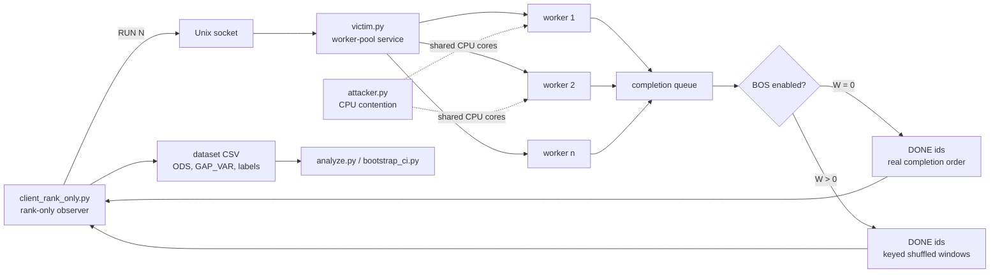

# ordleak

> Rank-only completion-order leakage experiments and mitigation via Budgeted Order Scrubbing (BOS).

[](LICENSE)


---

## Table of contents

- [Overview](#overview)
- [Core idea](#core-idea)
- [What makes this interesting](#what-makes-this-interesting)
- [Threat model](#threat-model)
- [Ethical scope](#ethical-scope)
- [Repository layout](#repository-layout)
- [System architecture](#system-architecture)
- [Experimental stages](#experimental-stages)
- [Metrics](#metrics)
- [Headline results](#headline-results)
- [Result figures](#result-figures)
- [Quick start](#quick-start)
- [Reproducing the experiments](#reproducing-the-experiments)
- [Stage 1: attacker-presence leakage](#stage-1-attacker-presence-leakage)
- [Stage 2: secret-mode leakage](#stage-2-secret-mode-leakage)
- [Stage 3: BOS defense evaluation](#stage-3-bos-defense-evaluation)
- [Case study: PBKDF2 vs scrypt](#case-study-pbkdf2-vs-scrypt)
- [Implementation details](#implementation-details)
- [CSV schema](#csv-schema)
- [How to interpret the results](#how-to-interpret-the-results)
- [Known limitations](#known-limitations)
- [Recommended cleanup before publication](#recommended-cleanup-before-publication)
- [Citation](#citation)
- [License](#license)

---

## Overview

`ordleak` is a research artifact for studying whether **completion order alone** can leak information in an asynchronous service.

The project intentionally assumes a weak observer:

- no timestamps,
- no fine-grained timing measurements,
- no performance counters,
- no privileged instrumentation,
- only the order in which a service emits messages such as `DONE <id>`.

The core observation is that asynchronous services often reveal a **rank order**: request 7 finished before request 2, request 2 finished before request 13, and so on. Even if the client never sees exact latencies, that order can still carry information.

This repository explores three questions:

1. **Attacker presence:**  
   Can an observer distinguish whether a co-resident CPU-contention process is present from completion order alone?

2. **Victim secret:**  
   Can completion order reveal a victim-internal mode, such as CPU-heavy vs memory-heavy work?

3. **Mitigation:**  
   Can a server-side defense reduce this leakage by reordering completions before releasing them?

The repository contains runnable Python components, experiment scripts, stored CSV datasets, reproduction notes, and consolidated result tables.

---

## Core idea

The service executes jobs in parallel. Each job has an integer ID. The client submits a batch:

```text
RUN 20
```

The server responds only with completion IDs:

```text
DONE 0
DONE 2
DONE 1
DONE 4
DONE 3
...
```

The client does **not** record timestamps. It only records the sequence of job IDs.

A perfectly FIFO-like execution would return something close to:

```text
0, 1, 2, 3, 4, ...
```

A disrupted execution may return a more shuffled sequence:

```text
0, 3, 1, 5, 2, 4, ...
```

`ordleak` converts these sequences into rank-only features such as an Order Disruption Score (ODS), then evaluates whether these features distinguish different experimental conditions.

---

## What makes this interesting

Many side-channel studies rely on precise timers, hardware performance counters, or high-resolution measurements. `ordleak` deliberately avoids that.

The artifact demonstrates that leakage can survive even when the observer sees only a coarse ordinal signal:

```text
Which request completed first?
Which completed second?
Which completed third?
...
```

This is relevant for systems that use:

- worker pools,
- asynchronous services,
- IPC protocols,
- local sockets,
- message queues,
- completion callbacks,
- batched request processing,
- multi-tenant CPU sharing.

The project is also interesting because it includes a mitigation: **Budgeted Order Scrubbing (BOS)**.

---

## Threat model

The high-level threat model is intentionally constrained.

| Role | Capability |
|---|---|
| Victim | A user-space service executes batches of jobs using a worker pool. |
| Observer | An unprivileged client submits batches and observes only `DONE <id>` completion order. |
| Co-resident process | An unprivileged process creates CPU contention on shared cores. |
| Goal | Infer attacker presence or victim mode from rank-only completion order. |

The observer does not need:

- timestamps,
- access to `/proc` internals,
- `perf`,
- hardware counters,
- root privileges,
- exact latency measurements,
- direct memory access.

The attacker model is local and co-resident. This repository is not about remote exploitation, privilege escalation, malware, or production attacks.

---

## Ethical scope

This project should be used as a controlled research artifact.

Appropriate uses:

- academic evaluation of order-based leakage,
- measurement methodology,
- side-channel mitigation research,
- reproducibility study,
- teaching artifact for systems/security courses,
- portfolio demonstration of experimental systems work.

Out-of-scope uses:

- targeting third-party systems,
- bypassing access control,
- disrupting production systems,
- using contention to degrade services without authorization,
- deploying the scripts against systems you do not own or have permission to test.

The repository is best understood as a **minimal local model** of a broader systems phenomenon.

---

## Repository layout

Current high-level layout:

```text
.
├── docs/
│   ├── README.md          # existing conceptual notes
│   ├── Command.md         # script inventory and command examples
│   ├── REPRODUCE.md       # step-by-step reproduction notes
│   └── RESULT.md          # consolidated result tables
├── out/
│   ├── csv/               # stored CSV datasets
│   │   ├── stage1/        # attacker-presence datasets
│   │   ├── stage2/        # CPU-vs-MEM secret-mode datasets
│   │   ├── stage3/        # BOS defense sweep datasets
│   │   ├── study/         # KDF case-study datasets
│   │   ├── time_BOS/      # BOS overhead summaries
│   │   └── time_e2e/      # end-to-end overhead summaries
│   └── victim.sock        # local Unix socket artifact; should usually not be committed
├── scripts/
│   ├── analyze.py         # ODS/GAP_VAR statistics, AUC, threshold accuracy
│   ├── bootstrap_ci.py    # bootstrap confidence intervals
│   ├── run_dataset.py     # repeated dataset collection
│   ├── overhead_sweep.sh
│   └── overhead_sweep_pure.sh
├── src/
│   ├── attacker.py        # CPU contention process
│   ├── client_rank_only.py# rank-only observer client
│   └── victim.py          # asynchronous worker-pool victim service + BOS
├── .gitignore
├── LICENSE
└── README.md
```

---

## System architecture



---

## Experimental stages

The artifact is organized into three main experimental stages and one case study.

| Stage | Question | Main labels | Output directory |
|---|---|---|---|
| Stage 1 | Is co-resident attacker presence visible from completion order? | `BASELINE` vs `ATTACK` | `out/csv/stage1/` |
| Stage 2 | Does a victim-internal CPU/MEM mode become inferable? | `CPU_*` vs `MEM_*` | `out/csv/stage2/` |
| Stage 3 | Can BOS reduce order-based leakage? | `CPU_ATT_W*` vs `MEM_ATT_W*` | `out/csv/stage3/` |
| Case study | Does the signal generalize to KDF workloads? | PBKDF2 vs scrypt | `out/csv/study/` |

---

## Metrics

### ODS — Order Disruption Score

ODS is the normalized inversion count of the observed completion sequence.

For a sequence of job IDs:

```text
[0, 2, 1, 3]
```

there is one inversion: `2` appears before `1`, even though `2 > 1`.

ODS is:

```text
number of inversions / maximum possible inversions
```

Interpretation:

| ODS value | Meaning |
|---|---|
| near 0 | completion order close to FIFO |
| around 0.5 | heavily mixed/random-like order |
| near 1 | strongly reversed order |

### GAP_VAR

`GAP_VAR` is the variance of absolute gaps between consecutive job IDs in the observed sequence.

Example:

```text
sequence = [0, 4, 1, 5, 2]
gaps     = [4, 3, 4, 3]
```

Higher variance indicates more irregular jumps through the job-ID space.

### AUC

The analysis scripts compute ROC AUC for rank-only features such as ODS and GAP_VAR.

Interpretation:

| AUC | Meaning |
|---|---|
| 0.50 | random guessing |
| 0.60–0.70 | weak signal |
| 0.70–0.80 | moderate signal |
| 0.80–0.90 | strong signal |
| > 0.90 | very strong signal |

### Balanced accuracy

The bootstrap script estimates balanced accuracy and confidence intervals. Balanced accuracy is useful because it is robust to class imbalance.

### Bootstrap confidence intervals

`bootstrap_ci.py` uses bootstrap resampling to estimate uncertainty, typically with `B=5000` resamples.

---

## Headline results

### Stage 1: attacker presence

Attacker presence is strongly distinguishable from rank-only completion order.

| Hardware | ODS AUC range | Negative control |
|---|---:|---:|
| AMD Threadripper 3970X | approximately 0.887–0.990 | around 0.535 |
| Intel i9-7900X | approximately 0.959–0.992 | around 0.544 |

Interpretation: when the attacker shares victim cores, completion order changes enough to be detected. When the attacker is placed off-core, the signal drops close to chance.

### Stage 2: CPU-vs-MEM secret-mode leakage

Without attacker, CPU vs MEM mode is near chance. With co-resident CPU contention, the mode becomes distinguishable.

| Hardware | Baseline ODS AUC | Attack ODS AUC | Off-core control |
|---|---:|---:|---:|
| AMD Threadripper 3970X | 0.476 | 0.800 | 0.553 |
| Intel i9-7900X | 0.468 | 0.739 | 0.587 |

Interpretation: attacker-induced contention amplifies victim-mode differences in rank-only completion order.

### Stage 3: BOS defense

BOS reduces leakage by buffering completion IDs and releasing them in a keyed pseudorandom permutation.

| BOS window W | ODS AUC | GAP_VAR AUC | Interpretation |
|---:|---:|---:|---|
| 0 | 0.821 | 0.835 | strong leakage |
| 4 | 0.750 | 0.724 | reduced but present |
| 8 | 0.773 | 0.789 | non-monotonic bump |
| 12 | 0.677 | 0.514 | ODS weak, GAP_VAR near chance |
| 14 | 0.501 | 0.597 | ODS neutralized, residual GAP_VAR signal |
| 16 | 0.449 | 0.461 | near chance |

Interpretation: for this setup, `W >= 14` is approximately the safe zone for ODS, and `W = 16` neutralizes both ODS and GAP_VAR.

### KDF case study

The case study compares PBKDF2-HMAC-SHA256 and scrypt.

| Condition | ODS AUC | GAP_VAR AUC | Interpretation |
|---|---:|---:|---|
| `W=0` | 0.835 | 0.749 | distinguishable |
| `W=16` | 0.484 | 0.494 | near chance |

Interpretation: completion-order fingerprinting generalizes beyond synthetic CPU/MEM modes, and BOS suppresses the signal in the tested configuration.

---

## Result figures

The following figures are generated from the consolidated result tables.

### Stage 1 — attacker-presence leakage

<p align="center">
  
</p>

### Stage 2 — secret-mode leakage

<p align="center">
  
</p>

### Stage 3 — BOS defense sweep

<p align="center">
  
</p>

### KDF case study

<p align="center">
  
</p>

---

## Quick start

Clone the repository:

```bash
git clone https://github.com/TheBuccaneer/ordleak.git
cd ordleak
```

Create and activate a Python environment:

```bash
python3 -m venv .venv
source .venv/bin/activate
```

Install basic dependencies:

```bash
pip install numpy scipy scikit-learn pandas matplotlib
```

The core experiment scripts use the Python standard library for the service/client path. The analysis and plotting workflow may require scientific Python packages depending on what you run.

---

## Reproducing the experiments

The repository already contains detailed command references:

- `docs/Command.md` — script inventory and copy/paste commands
- `docs/REPRODUCE.md` — reproduction guide
- `docs/RESULT.md` — consolidated result tables and command lines

The typical workflow uses multiple terminals.

### Terminal 1: start the victim service

CPU mode:

```bash
cd ~/projects/ordleak
rm -f out/victim.sock out/victim_cpu.sock

taskset -c 0,1 python3 -u src/victim.py \
    --sock out/victim_cpu.sock \
    --mode cpu \
    --workers 2 \
    --iters 200000

ln -sf victim_cpu.sock out/victim.sock
```

MEM mode:

```bash
cd ~/projects/ordleak
rm -f out/victim.sock out/victim_mem.sock

taskset -c 0,1 python3 -u src/victim.py \
    --sock out/victim_mem.sock \
    --mode mem \
    --mem-kb 8192 \
    --workers 2 \
    --iters 200000

ln -sf victim_mem.sock out/victim.sock
```

### Terminal 2: collect a dataset

Baseline:

```bash
taskset -c 0,1 python3 scripts/run_dataset.py \
    --runs 100 \
    --n 20 \
    --label BASELINE \
    --out out/csv/stage1/example_dataset.csv
```

Attack:

```bash
taskset -c 0,1 python3 scripts/run_dataset.py \
    --runs 100 \
    --n 20 \
    --attack \
    --attack-procs 32 \
    --attack-seconds 5 \
    --label ATTACK \
    --out out/csv/stage1/example_dataset.csv
```

### Terminal 3: optional off-core negative control

```bash
taskset -c 2-31 python3 -u src/attacker.py \
    --procs 32 \
    --seconds 600
```

The negative-control idea is that the attacker is running, but not on the victim cores. A clean negative control should move the signal toward chance.

---

## Stage 1: attacker-presence leakage

### Question

Can the observer distinguish:

```text
BASELINE: victim service only
ATTACK:   victim service + co-resident CPU contention
```

using only completion order?

### Dataset structure

Example files:

```text
out/csv/stage1/threadripper/first run_ripper/
├── run1_dataset.csv
├── run2_dataset.csv
├── run3_dataset.csv
├── run4_dataset.csv
├── run5_dataset.csv
└── run6_negctrl_vs_base.csv
```

Intel layout:

```text
out/csv/stage1/intel_i9_790x/runset1/
├── run1_dataset.csv
├── run2_dataset.csv
├── run3_dataset.csv
├── run4_dataset.csv
├── run5_dataset.csv
└── run6_negctrl_vs_base.csv
```

### Analysis

```bash
python3 scripts/analyze.py out/csv/stage1/threadripper/first\ run_ripper/run1_dataset.csv

python3 scripts/bootstrap_ci.py \
    out/csv/stage1/threadripper/first\ run_ripper/run1_dataset.csv
```

Negative control:

```bash
python3 scripts/analyze.py \
    out/csv/stage1/threadripper/first\ run_ripper/run6_negctrl_vs_base.csv \
    --pos-label NEGCTRL_OFFCORE \
    --neg-label BASELINE
```

### Result interpretation

A high AUC means the rank-only completion sequence is enough to identify the presence of co-resident CPU contention. A near-chance negative control supports that the signal is specifically related to shared-core contention rather than arbitrary background activity.

---

## Stage 2: secret-mode leakage

### Question

Can completion order reveal a victim-internal mode?

The victim supports at least two synthetic modes:

| Mode | Meaning |
|---|---|
| `cpu` | deterministic CPU-heavy work |
| `mem` | deterministic cache/TLB-unfriendly memory-heavy work |

Stage 2 compares:

```text
CPU_BASE vs MEM_BASE
CPU_ATT  vs MEM_ATT
CPU_NEGCTRL_OFFCORE vs MEM_NEGCTRL_OFFCORE
```

### Analysis

Baseline secret leakage:

```bash
python3 scripts/analyze.py \
    out/csv/stage2/threadripper/secret_tr_base.csv \
    --pos-label MEM_BASE \
    --neg-label CPU_BASE
```

Attacker-amplified secret leakage:

```bash
python3 scripts/analyze.py \
    out/csv/stage2/threadripper/secret_tr_att.csv \
    --pos-label MEM_ATT \
    --neg-label CPU_ATT
```

Bootstrap confidence intervals:

```bash
python3 scripts/bootstrap_ci.py \
    out/csv/stage2/threadripper/secret_tr_att.csv \
    --pos-label MEM_ATT \
    --neg-label CPU_ATT
```

### Result interpretation

The key result is not simply that CPU and MEM differ. The stronger claim is:

> Without the co-resident attacker, the secret-mode signal is near chance. With the attacker, the signal becomes substantially more distinguishable.

This makes the attacker an amplifier of an otherwise weak order-based side channel.

---

## Stage 3: BOS defense evaluation

### BOS: Budgeted Order Scrubbing

BOS buffers completion IDs and releases them in a keyed pseudorandom order.

```text
Real completion order:
0, 1, 3, 2, 5, 4, 6, 7

With W=4:
buffer: [0, 1, 3, 2] -> shuffle -> [3, 0, 2, 1]
buffer: [5, 4, 6, 7] -> shuffle -> [4, 7, 5, 6]
```

The goal is not to hide the fact that jobs completed. The goal is to reduce how much information is encoded in the exact order of completions.

### Threat model for BOS

| Property | Assumption |
|---|---|
| Seed | Server-side secret |
| Window W | May be observable due to bursty output |
| PRNG state | Continuous, not reset for every flush |
| Goal | Reduce order-based distinguishability |

### Running a BOS experiment

Start victim with BOS enabled:

```bash
taskset -c 0,1 python3 -u src/victim.py \
    --sock out/victim_cpu.sock \
    --mode cpu \
    --workers 2 \
    --iters 200000 \
    --scrub-window 16 \
    --scrub-seed 42
```

Collect dataset with matching trace metadata:

```bash
taskset -c 0,1 python3 scripts/run_dataset.py \
    --runs 100 \
    --n 20 \
    --attack \
    --attack-procs 16 \
    --attack-seconds 5 \
    --label CPU_ATT_W16 \
    --scrub-window 16 \
    --scrub-seed 42 \
    --out out/csv/stage3/stage2_att_W16_r100.csv
```

Important: `--scrub-window` in `scripts/run_dataset.py` records metadata in the CSV. It does not configure the already-running victim. The victim must be started with matching scrubber settings.

### Result interpretation

The current result table shows that larger `W` values reduce leakage. The behavior is not perfectly monotonic: `W=8` leaks more than `W=4` in the measured data. This is an important design insight, because buffering can itself create recognizable chunk/flush patterns.

---

## Case study: PBKDF2 vs scrypt

The repository also includes a cryptographic workload case study:

| Workload | Type |
|---|---|
| PBKDF2-HMAC-SHA256 | CPU-bound KDF |
| scrypt | memory-hard KDF |

Victim modes:

```bash
--mode pbkdf2
--mode scrypt
```

The case study shows:

- without BOS (`W=0`), PBKDF2 vs scrypt is distinguishable from completion order,
- with BOS (`W=16`), the signal drops close to chance.

This suggests that the phenomenon is not limited to synthetic CPU/MEM loops.

---

## Implementation details

### `src/victim.py`

The victim service:

- opens a Unix domain socket,
- accepts `RUN <n>` requests,
- creates a worker pool,
- enqueues jobs with IDs `0..n-1`,
- collects completions from a multiprocessing queue,
- emits `DONE <id>` in completion order,
- optionally applies BOS before sending IDs.

Supported work modes include:

| Mode | Description |
|---|---|
| `cpu` | deterministic CPU-heavy loop |
| `mem` | deterministic cache/TLB-unfriendly memory access |
| `pbkdf2` | PBKDF2-HMAC-SHA256 |
| `scrypt` | memory-hard scrypt KDF |

### `src/client_rank_only.py`

The client:

- connects to the Unix socket,
- sends `RUN <n>`,
- reads `DONE <id>` lines,
- writes only the observed order to a log file.

It intentionally does not record timestamps.

### `src/attacker.py`

The attacker process:

- starts a configurable number of busy-loop worker processes,
- runs for a fixed number of seconds,
- creates CPU contention.

This script is used for controlled local experiments only.

### `scripts/run_dataset.py`

The dataset runner:

- repeatedly invokes the rank-only client,
- optionally starts the contention process,
- parses the resulting `DONE <id>` sequence,
- computes ODS, GAP_VAR, and first-half ODS,
- appends rows to a CSV.

### `scripts/analyze.py`

The analysis script:

- reads a dataset CSV,
- maps labels to positive/negative classes,
- computes class statistics,
- computes Cohen's d,
- computes ROC AUC,
- finds a best threshold accuracy.

### `scripts/bootstrap_ci.py`

The bootstrap script:

- resamples the dataset,
- computes bootstrap AUC,
- computes bootstrap balanced accuracy,
- reports 95% confidence intervals.

---

## CSV schema

A typical dataset row contains:

| Column | Meaning |
|---|---|
| `run_id` | Unique run identifier |
| `label` | Experimental class, e.g. `BASELINE`, `ATTACK`, `CPU_ATT` |
| `n` | Number of jobs in the batch |
| `ods` | Order Disruption Score |
| `gap_var` | Variance of completion-ID gaps |
| `first_half_ods` | ODS computed only on the first half of the sequence |
| `scrub_window` | BOS window size recorded for traceability |
| `scrub_seed` | BOS seed recorded for traceability |

Example:

```csv
run_id,label,n,ods,gap_var,first_half_ods,scrub_window,scrub_seed
attack_000,ATTACK,20,0.142105,7.321330,0.088889,0,42
```

---

## How to interpret the results

### A high AUC does not mean timestamps were used

The analysis relies on rank-only features. If the signal is strong, that means the ordering pattern itself carries information.

### Negative controls are central

The off-core negative controls are important because they test whether the signal collapses when the contention source no longer shares victim cores.

### BOS does not make jobs faster

BOS is not a performance optimization. It is a mitigation that trades some ordering fidelity and possible output burstiness for reduced leakage.

### Non-monotonic defense behavior matters

The `W=8` result demonstrates that larger windows do not automatically produce monotonically lower leakage. Some window sizes can introduce structured output artifacts.

### KDF results are especially useful

PBKDF2 vs scrypt makes the artifact more convincing because it moves beyond synthetic loops and tests recognizable cryptographic primitives.

---

## Known limitations

- The service is a simplified local model, not a production server.
- The experiments are CPU-co-residency experiments, not remote network attacks.
- The attacker is a synthetic contention process.
- Results depend on CPU topology, pinning, scheduler behavior, and background load.
- Some CSV files depend on exact command-line context not fully encoded in the CSV.
- The current repository includes `out/victim.sock`, which is a local runtime artifact and should usually not be committed.
- Stage 2 Intel negative control is not perfectly at chance and should be treated as a sanity-check result rather than a definitive null result.
- BOS is evaluated as a prototype mitigation, not a formally proven defense.
- Output burstiness may reveal the BOS window size.
- The seed-based shuffle is deterministic for reproducibility, not necessarily a production-grade cryptographic construction.

---

## Recommended cleanup before publication

### 1. Remove local runtime artifacts

`out/victim.sock` should not be versioned.

Add to `.gitignore`:

```gitignore
out/*.sock
out/logs/
__pycache__/
*.pyc
.venv/
```

### 2. Add `requirements.txt`

Suggested minimal file:

```text
numpy
scipy
scikit-learn
pandas
matplotlib
```

If the core scripts stay standard-library-only, note that explicitly.

### 3. Move final figures into `docs/assets/`

Recommended structure:

```text
docs/assets/
├── stage1_attacker_presence_auc.png
├── stage2_secret_leakage_auc.png
├── stage3_bos_auc_vs_window.png
└── kdf_case_study_auc.png
```

### 4. Add a short paper-style abstract

A concise abstract at the top of the README would make the repo easier to understand for reviewers and recruiters.

### 5. Add a one-command demo

A small smoke-test script would help readers verify the local setup:

```bash
bash scripts/demo_small.sh
```

The demo should run a tiny version with a few runs and clearly state that it is not statistically meaningful.

### 6. Add hardware metadata

Add `docs/HARDWARE.md` with:

```bash
lscpu
uname -a
python3 --version
numactl --hardware
```

### 7. Separate raw data from derived tables

Recommended layout:

```text
data/raw/
data/processed/
results/tables/
results/figures/
```

### 8. Add a citation file

Add `CITATION.cff` for easier academic reuse.

---

## Citation

If you use this repository, cite the repository and include the commit hash, hardware, CPU pinning, and exact CSV files used.

Suggested BibTeX:

```bibtex
@misc{ordleak2026,
  author       = {Thomas},
  title        = {ordleak: Rank-only completion-order leakage experiments and mitigations},
  year         = {2026},
  howpublished = {\url{https://github.com/TheBuccaneer/ordleak}},
  note         = {Research artifact for ordinal completion-order leakage}
}
```

Recommended reporting fields:

- repository URL,
- commit hash,
- CPU model,
- core pinning,
- victim mode,
- attacker process count,
- attacker duration,
- number of jobs per run,
- number of runs per class,
- BOS window and seed,
- CSV files used,
- analysis script version.

---

## License

This repository is released under the Apache License 2.0. See [LICENSE](LICENSE).
